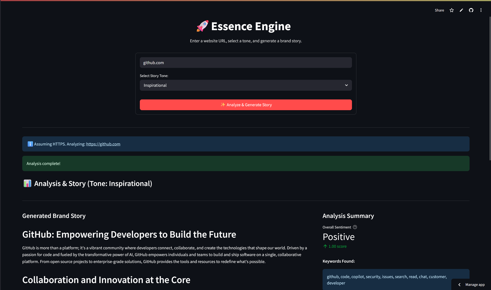

# Essence Engine 🚀

**AI-Powered Brand Story Generator**

[](https://brandstory.streamlit.app/)

---

**Essence Engine** instantly analyzes a company's online presence from just a website URL. It intelligently scrapes web content, identifies social media links, performs NLP analysis for keywords and sentiment, and leverages Generative AI (Google Gemini) to craft a compelling, tone-adjustable brand story.

This tool is designed for **Marketing Agencies, Brand Strategists, and Content Creators** who need rapid, data-driven insights into a brand's digital identity and narrative.



---

## ✨ Features

* **URL Input:** Simple interface requires only a company's website URL.
* **Web & Social Scraping:** Fetches website text and identifies key social media profile links (LinkedIn, Twitter, Facebook, YouTube, etc.). Includes experimental social bio scraping.
* **NLP Analysis:** Extracts prominent keywords and determines overall sentiment (Positive/Neutral/Negative + Score) using NLTK/VADER.
* **AI Story Generation:** Uses Google Gemini (via API) to generate a structured brand story based on the scraped data and analysis results.
* **Tone Control:** Allows users to select the desired tone (e.g., Formal, Casual, Witty) for the generated story.
* **Integrated UI:** User-friendly Streamlit dashboard displays the story, analysis summary, social links (with icons), and optional keyword word cloud.
* **PDF Export:** Generates and offers a downloadable PDF report of the brand story using `markdown-pdf`.

---

## 🛠️ Tech Stack

* **Language:** Python 3
* **Frontend:** Streamlit
* **Web Scraping:** Requests, BeautifulSoup4
* **NLP:** NLTK (VADER)
* **AI Model:** Google Gemini API (via `google-generativeai` SDK)
* **PDF Generation:** markdown-pdf, PyMuPDF
* **Core Libraries:** os, sys, json, base64, subprocess, dotenv, argparse
* **Environment:** Python Virtual Environment (`venv`)

---

## 🚀 Getting Started (Local Setup)

Follow these steps to set up and run Essence Engine locally:

### 1. Prerequisites
- Python 3.9+ installed.
- Git installed.

### 2. Clone the Repository
```bash
git clone https://github.com/shubhamkarkhanis/brand_story.git
cd brand_story
```

### 3. Create and Activate Virtual Environment
It's crucial to use a virtual environment to manage dependencies.
```bash
# Create the virtual environment
python3 -m venv venv

# Activate the virtual environment
# On Linux/macOS/WSL:
source venv/bin/activate
# On Windows (Git Bash):
source venv/Scripts/activate
# On Windows (CMD/PowerShell):
venv\Scripts\activate
```
You should see `(venv)` at the beginning of your terminal prompt.

### 4. Install Dependencies
```bash
pip install -r requirements.txt
```
*(If you encounter issues with `markdown-pdf` or `PyMuPDF`, consult their documentation for potential system-level dependencies.)*

### 5. Set Up API Key
The application uses the Google Gemini API for story generation.
- Get an API key from [Google AI Studio](https://aistudio.google.com/app/apikey)
- Create a file named `.env` in the project root (same directory as `app.py`)
```dotenv
# .env file
GOOGLE_API_KEY=YOUR_API_KEY_HERE
```

### 6. (Optional) Add Local Assets
- If you want local background/social icons, ensure the `assets/` folder exists in the root and contains the necessary images (e.g., `bg.jpg`, `linkedin.png`, `twitter.png`, etc.).

---

## ▶️ Running Locally

1. Make sure your virtual environment is activated:
```bash
source venv/bin/activate
```
2. Run the Streamlit app:
```bash
streamlit run app.py
```
3. Open the provided local URL (usually `http://localhost:8501`) in your web browser.

---

## 🧑‍💻 Team

* Shubham Karkhanis
* Shravani Joshi
* Gaurav Mohagaonkar
* Parth Kolekar

*(Hackathon Project)*

---

## 🙏 Acknowledgements

* Streamlit for the awesome app framework.
* Google for the Generative AI API.
* The developers of the various open-source libraries used.
* Flaticon and respective creators for icon assets (if applicable).

---
